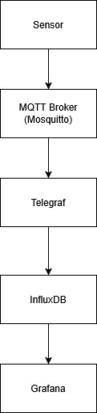
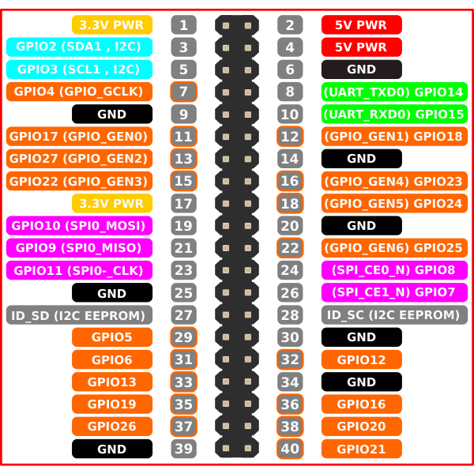
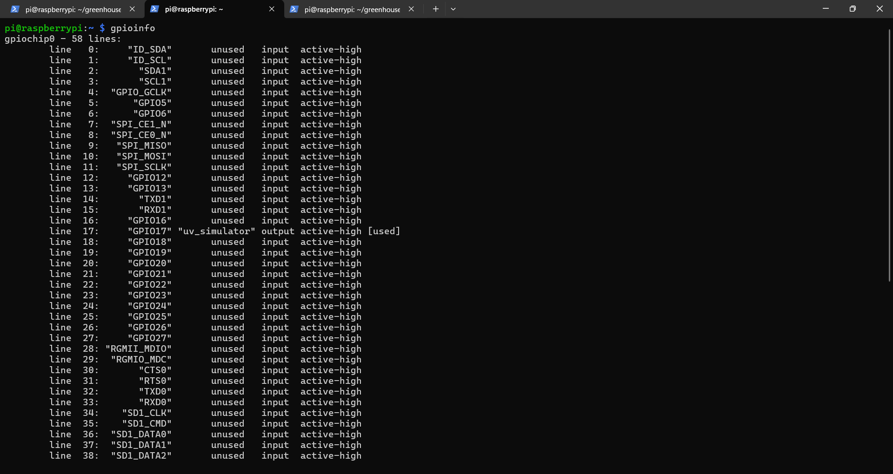
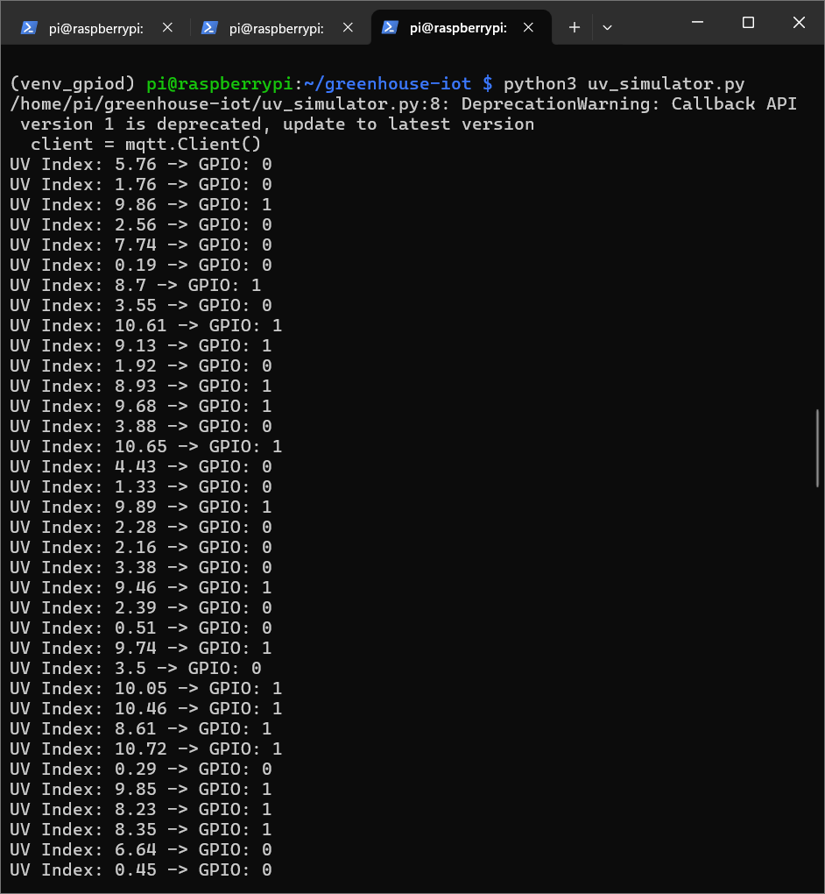
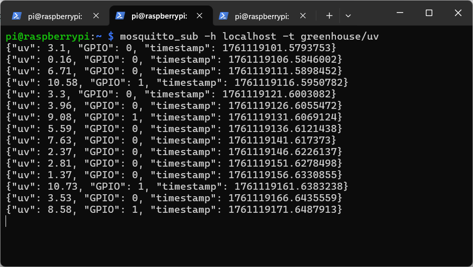
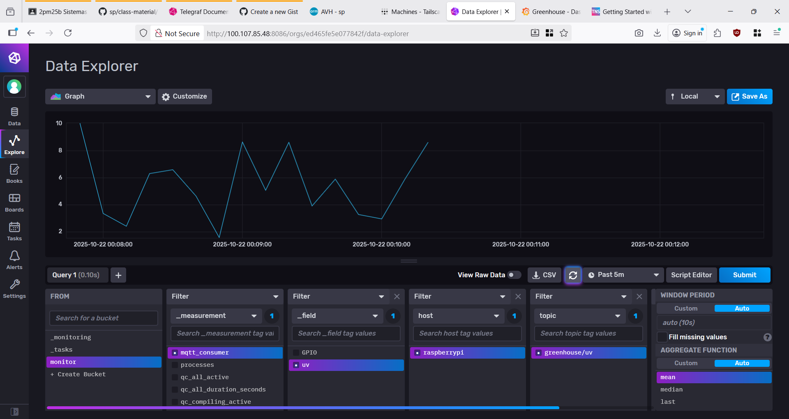
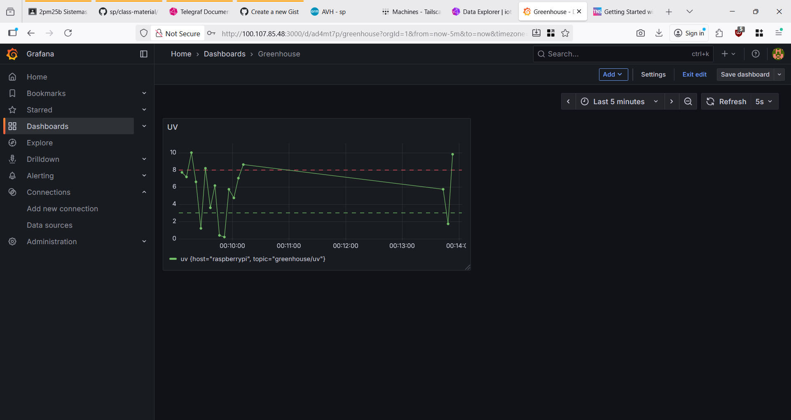

# Monitoreo UV en cultivos de invernadero

## Porqué es importante?
Se monitorea la radiación UV en un invernadero para maximizar los beneficios para las plantas y minimizar sus daños. Monitorear la UV ayuda a controlar el crecimiento de patógenos y plagas, a mejorar el color, el sabor y la resistencia de las plantas, y a prevenir daños en las hojas como quemaduras

## Stack de Herramientas
Raspberry Pi 4, Sensor UV, Python, MQTT Mosquitto, Telegraf, InfluxDB y Grafana

## Raspberry Pi
Revisar con gpioinfo las lineas disponibles

## Código python
~~~ python
import gpiod
import time
import random
import paho.mqtt.client as mqtt
import json

# Setup MQTT
client = mqtt.Client()
client.connect("localhost", 1883, 60)

# Setup GPIO (simulated output pin)
chip = gpiod.Chip('gpiochip0')
line = chip.get_line(17)  # use any available GPIO line
line.request(consumer="uv_simulator", type=gpiod.LINE_REQ_DIR_OUT)

while True:
    # Simulate UV index (0–11)
    uv_index = round(random.uniform(0, 11), 2)

    # Convert to HIGH if UV dangerous
    gpio_value = 1 if uv_index > 8 else 0
    line.set_value(gpio_value)

    payload = json.dumps({
        "uv": uv_index,
        "GPIO": gpio_value,
        "timestamp": time.time()
    })

    print(f"UV Index: {uv_index} -> GPIO: {gpio_value}")

    # Publish to MQTT
    client.publish("greenhouse/uv", payload)
    time.sleep(5)
~~~
    
## Configuración de Telegraf
~~~
[[inputs.mqtt_consumer]]
  servers = ["tcp://127.0.0.1:1883"]
  topics = ["greenhouse/uv"]
  qos = 0
  connection_timeout = "30s"
  data_format = "json"
  json_name_key = "sensor"
  json_time_key = "timestamp"
  
[[outputs.influxdb_v2]]
  urls = ["http://127.0.0.1:8086"]
  token = "jn-dFfSsfBS77xwkR1-2CvmMwT"
  organization = "iot-pi"
  bucket = "monitor"
  ~~~

    
## Simulación

## Panel en InfluxDB

## Panel en Grafana

